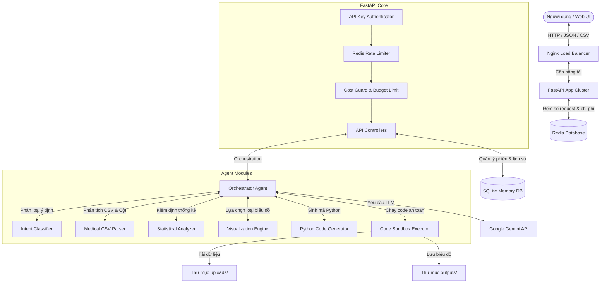

# Giới thiệu & Hướng dẫn sử dụng Medical Research AI Agent

Chào mừng bạn đến với dự án **Medical Research AI Agent** (Phiên bản Production-Ready). Tài liệu này cung cấp cái nhìn toàn diện về kiến trúc hệ thống, các module chức năng, các tính năng vận hành ở quy mô production, và hướng dẫn chi tiết cách chạy cũng như triển khai ứng dụng.

---

## 1. Giới thiệu tổng quan (Overview)

**Medical Research AI Agent** là một hệ thống AI hỗ trợ các nhà nghiên cứu y khoa phân tích dữ liệu lâm sàng từ các file CSV. Hệ thống tự động nhận diện cấu trúc nghiên cứu y khoa, thực hiện các phân tích thống kê phù hợp, thiết kế biểu đồ trực quan hóa chuyên nghiệp (sử dụng Seaborn/Matplotlib), và tự động viết nhận xét lâm sàng (clinical insights).

Hệ thống được thiết kế để đáp ứng các tiêu chuẩn khắt khe ở môi trường Production:
- **Tự sửa lỗi (Self-Healing Code)**: Agent tự chạy thử mã Python tạo biểu đồ, nếu lỗi sẽ tự động nhờ LLM phân tích log lỗi để sửa lại tối đa 3 lần.
- **Bảo mật và Kiểm soát tài nguyên**: Sử dụng cơ chế xác thực bằng API Key, giới hạn tần suất yêu cầu (Rate Limiting) bằng Redis, và kiểm soát ngân sách gọi LLM hàng tháng (Cost Guard).
- **Khả năng mở rộng (Scalability)**: Hỗ trợ triển khai Cluster nhiều bản sao (replica) chạy phía sau Nginx Load Balancer, hỗ trợ giám sát sức khỏe container thông qua các API `/health` và `/ready`.

---

## 2. Kiến trúc hệ thống (System Architecture)

Dưới đây là sơ đồ luồng dữ liệu và tương tác giữa các thành phần trong hệ thống:



### Chi tiết các Module chức năng (agents/ & modules/)

1. **Orchestrator Agent ([orchestrator.py](file:///d:/user/Desktop/Github/batch02-day12_cloud_infras_and_deployment-vinh/06-lab-complete/agents/orchestrator.py))**:
   - Bộ não trung tâm của ứng dụng. Nhận tin nhắn từ API, khôi phục ngữ cảnh hội thoại, phối hợp các module để xử lý yêu cầu.
   - Triển khai vòng lặp **tự sửa lỗi (Self-Healing)**: Khi chạy code sinh biểu đồ bị lỗi, Orchestrator sẽ gửi code lỗi + thông báo Traceback về cho Gemini để sinh bản vá và thử chạy lại.

2. **Intent Classifier ([intent_classifier.py](file:///d:/user/Desktop/Github/batch02-day12_cloud_infras_and_deployment-vinh/06-lab-complete/agents/intent_classifier.py))**:
   - Phân tích câu lệnh của người dùng để xác định mục đích: Upload file mới (`ANALYZE_NEW`), Tạo biểu đồ (`CREATE_CHART`), Sửa biểu đồ (`MODIFY_CHART`), Giải thích chuyên môn (`EXPLAIN_INSIGHT`), Xuất mã nguồn/tải biểu đồ (`EXPORT`), hoặc Câu hỏi thông thường (`GENERAL`).

3. **Medical CSV Parser ([input_layer.py](file:///d:/user/Desktop/Github/batch02-day12_cloud_infras_and_deployment-vinh/06-lab-complete/modules/input_layer.py))**:
   - Tự động nhận diện định dạng mã hóa (Encoding) và dấu phân tách (Delimiter - phẩy, chấm phẩy, tab).
   - Phát hiện các kiểu dữ liệu cột và đặc biệt là nhận diện vai trò y khoa (Medical Role) của từng cột (ví dụ: biến dự đoán/can thiệp - Predictor, kết cục lâm sàng - Outcome, biến gây nhiễu - Covariate).

4. **Statistical Analyzer ([data_analysis.py](file:///d:/user/Desktop/Github/batch02-day12_cloud_infras_and_deployment-vinh/06-lab-complete/modules/data_analysis.py))**:
   - Tính toán các thống kê mô tả cơ bản (Mean, Median, Std, Min, Max, tỷ lệ phần trăm các lớp phân loại).
   - Tự động phân loại mô hình nghiên cứu (Study Type) dựa trên phân bố dữ liệu: Thử nghiệm ngẫu nhiên có đối chứng (RCT), Nghiên cứu cắt ngang (Cross-Sectional), Nghiên cứu bệnh-chứng (Case-Control), hoặc Nghiên cứu đoàn hệ (Cohort).
   - Đề xuất các phương pháp phân tích/kiểm định thống kê phù hợp (t-test, ANOVA, Chi-square, Kaplan-Meier survival analysis).

5. **Visualization Engine ([visualization_engine.py](file:///d:/user/Desktop/Github/batch02-day12_cloud_infras_and_deployment-vinh/06-lab-complete/modules/visualization_engine.py))**:
   - Quyết định loại biểu đồ phù hợp nhất dựa trên số lượng và kiểu dữ liệu của các biến (ví dụ: Boxplot để so sánh biến liên tục giữa các nhóm điều trị, Scatter plot kèm đường hồi quy cho mối liên quan giữa 2 biến liên tục, Kaplan-Meier curve cho phân tích sinh tồn).

6. **Python Code Generator ([code_generator.py](file:///d:/user/Desktop/Github/batch02-day12_cloud_infras_and_deployment-vinh/06-lab-complete/modules/code_generator.py))**:
   - Cung cấp các mẫu code chuẩn (Seaborn/Matplotlib) đáp ứng yêu cầu thẩm mỹ y khoa (bảng màu thân thiện người mù màu, phông chữ trực quan, hiển thị p-value, chú thích đầy đủ).

7. **Code Executor ([code_executor.py](file:///d:/user/Desktop/Github/batch02-day12_cloud_infras_and_deployment-vinh/06-lab-complete/modules/code_executor.py))**:
   - Thực thi mã Python sinh ra trong môi trường an toàn (Sandbox).
   - Kiểm soát nghiêm ngặt các thư viện được phép import (`ALLOWED_IMPORTS`) và chặn các hàm/mẫu mã nguy hại (`BLOCKED_PATTERNS` như truy cập hệ thống file tùy ý, gọi subprocess, kết nối mạng trái phép).

8. **Memory Module ([memory.py](file:///d:/user/Desktop/Github/batch02-day12_cloud_infras_and_deployment-vinh/06-lab-complete/modules/memory.py))**:
   - Lưu trữ lịch sử hội thoại, thông tin dataset hiện tại, mã nguồn của các phiên bản biểu đồ trước đó vào cơ sở dữ liệu SQLite (`memory.db`), giúp Agent ghi nhớ ngữ cảnh khi người dùng yêu cầu tinh chỉnh biểu đồ ở các lượt chat sau.

---

## 3. Tính năng Production-Ready

Hệ thống được bọc bởi các lớp middleware trong FastAPI ([app/main.py](file:///d:/user/Desktop/Github/batch02-day12_cloud_infras_and_deployment-vinh/06-lab-complete/app/main.py)) để vận hành ổn định trên môi trường production:

*   **Xác thực API Key ([app/auth.py](file:///d:/user/Desktop/Github/batch02-day12_cloud_infras_and_deployment-vinh/06-lab-complete/app/auth.py))**:
    *   Tất cả các endpoint nghiệp vụ (chat, upload, budget, history) yêu cầu header `X-API-Key`.
    *   API Key được cấu hình qua biến môi trường `AGENT_API_KEY`.
*   **Redis Rate Limiting ([app/rate_limiter.py](file:///d:/user/Desktop/Github/batch02-day12_cloud_infras_and_deployment-vinh/06-lab-complete/app/rate_limiter.py))**:
    *   Giới hạn tần suất gọi API của mỗi API Key bằng thuật toán đếm sử dụng Redis (ví dụ: tối đa 30 requests/phút).
    *   Tránh các cuộc tấn công spam API hoặc làm quá tải LLM.
*   **Cost Guard ([app/cost_guard.py](file:///d:/user/Desktop/Github/batch02-day12_cloud_infras_and_deployment-vinh/06-lab-complete/app/cost_guard.py))**:
    *   Đếm số lượng từ/token đầu vào và đầu ra để ước lượng chi phí sử dụng API Gemini.
    *   Tích lũy chi phí theo từng API Key trong tháng vào Redis. Nếu vượt quá hạn mức cấu hình (`MONTHLY_BUDGET_USD`), hệ thống sẽ từ chối gọi LLM và trả về lỗi `402 Payment Required` để bảo vệ ngân sách.
*   **Health and Readiness Checks**:
    *   `/health`: Kiểm tra thông tin phiên bản, tình trạng sẵn sàng của Agent, uptime, mã instance ID của container đang xử lý request (hỗ trợ kiểm tra tải).
    *   `/ready`: Kiểm tra kết nối tới các dịch vụ phụ thuộc (Redis). Load Balancer sẽ chỉ định tuyến lưu lượng vào các container trả về trạng thái `ready` (HTTP 200).
*   **Graceful Shutdown**:
    *   FastAPI được cấu hình với cơ chế dọn dẹp kết nối (Lifespan): Đóng kết nối Redis an toàn khi container nhận tín hiệu tắt (SIGTERM/SIGINT) để không làm mất mát dữ liệu đang ghi.
*   **Cân bằng tải Nginx ([nginx.conf](file:///d:/user/Desktop/Github/batch02-day12_cloud_infras_and_deployment-vinh/06-lab-complete/nginx.conf))**:
    *   Nginx đóng vai trò Reverse Proxy & Load Balancer. Định tuyến các yêu cầu đến cụm FastAPI (`agent_cluster`) thông qua cơ chế DNS phân giải nội bộ của Docker Compose.
    *   Che giấu thông tin chi tiết của server backend bằng chỉ thị `server_tokens off`.

---

## 4. Hướng dẫn chạy local (Local Development & Demo)

Bạn có thể chạy ứng dụng ở 2 chế độ:
1.  **Demo Mode (Mặc định)**: Không yêu cầu khóa API Gemini. Các phản hồi của Agent sẽ được giả lập từ kết quả đọc schema CSV.
2.  **Full AI Mode**: Sử dụng mô hình Gemini thực tế để phân tích sâu và vẽ biểu đồ động.

### 4.1. Khởi chạy bằng Docker Compose

Cần cài đặt trước Docker và Docker Compose trên máy.

**Bước 1: Tạo file cấu hình môi trường**
Sao chép `.env.example` thành `.env` và tùy chỉnh các tham số:
```env
AGENT_API_KEY=dev-key-change-me
DEMO_MODE=true
# Nếu muốn dùng Full AI Mode, đặt DEMO_MODE=false và điền khóa Gemini:
GEMINI_API_KEY=your-gemini-api-key
GEMINI_MODEL=gemini-2.5-flash
RATE_LIMIT_PER_MINUTE=30
MONTHLY_BUDGET_USD=10.0
```

**Bước 2: Khởi động hệ thống (Scale 3 instances Agent)**
Chạy lệnh sau để tải các image, build code và chạy 3 bản sao ứng dụng cùng Nginx, Redis:
```powershell
docker compose up --build --scale agent=3 -d --wait
```

**Bước 3: Kiểm tra trạng thái hoạt động**
```powershell
docker compose ps
```
Nginx sẽ mở cổng **8000** trên máy local của bạn.

---

### 4.2. Trải nghiệm trên Giao diện Web (Web UI)
1.  Mở trình duyệt truy cập: [http://localhost:8000](http://localhost:8000)
2.  Mở rộng phần **API Key & Session** ở sidebar và nhập API Key: `dev-key-change-me` (hoặc key bạn tự đặt trong `.env`).
3.  Tải lên file dữ liệu mẫu có sẵn tại thư mục: `sample_data/clinical_trial_diabetes.csv`.
4.  Gửi các câu lệnh yêu cầu phân tích vào khung chat, ví dụ:
    *   *"Hãy vẽ biểu đồ so sánh HbA1c trước và sau điều trị"*
    *   *"Tạo biểu đồ phân bố độ tuổi của các bệnh nhân"*
    *   *"Chỉnh sửa biểu đồ hiện tại: đổi tông màu sang màu xanh lá cây"*

---

### 4.3. Các lệnh hữu ích khi chạy Local

*   **Xem logs hệ thống**:
    ```powershell
    docker compose logs -f
    ```
*   **Xóa bộ nhớ đệm (Reset Rate Limit & Cost Guard Budget)**:
    Khi kiểm thử hoặc thuyết trình, bạn có thể xóa toàn bộ dữ liệu Redis (Rate limit và chi phí đã dùng) bằng lệnh:
    ```powershell
    docker compose exec redis redis-cli FLUSHDB
    ```
*   **Dừng và dọn dẹp container**:
    ```powershell
    docker compose down
    ```
    *(Dùng thêm tham số `-v` nếu bạn muốn xóa sạch dữ liệu uploads, biểu đồ đã sinh và dữ liệu Redis: `docker compose down -v`)*

---

## 5. Các Endpoint API & Hướng dẫn gọi kiểm thử (API & Testing)

Bạn có thể sử dụng PowerShell hoặc `curl` để gọi các API của hệ thống:

### 5.1. Kiểm tra Sức khỏe (Health Check)
Không yêu cầu API Key.

*   **Lệnh gọi**:
    ```powershell
    Invoke-RestMethod -Uri http://localhost:8000/health -Method Get
    ```
*   **Kết quả mẫu**:
    ```json
    {
      "status": "ok",
      "agent_ready": true,
      "session_id": "8b5f3a12-...",
      "model": "gemini-2.5-flash",
      "instance_id": "medical-a1b2c3d4",
      "uptime_seconds": 128.5
    }
    ```

### 5.2. Kiểm tra Kết nối dịch vụ (Readiness Check)
Không yêu cầu API Key. Trả về HTTP 200 nếu kết nối Redis bình thường.

```powershell
Invoke-RestMethod -Uri http://localhost:8000/ready -Method Get
```

### 5.3. Xem ngân sách sử dụng (Cost Usage)
Yêu cầu header `X-API-Key`.

*   **Lệnh gọi**:
    ```powershell
    $headers = @{ "X-API-Key" = "dev-key-change-me" }
    Invoke-RestMethod -Uri http://localhost:8000/api/budget -Headers $headers -Method Get
    ```
*   **Kết quả mẫu**:
    ```json
    {
      "user_id": "dev-key-change-me",
      "cost_usd": 0.0452,
      "limit_usd": 10.0,
      "allowed": true
    }
    ```

---

## 6. Triển khai Cloud (Railway Deployment)

Dự án đã được cấu hình sẵn sàng để triển khai lên cloud [Railway](https://railway.app) thông qua file cấu hình `railway.toml` và `render.yaml`.

### Các bước thiết lập trên Railway:
1.  Tạo một dự án mới trên Railway.
2.  Thêm service **Redis** từ kho ứng dụng của Railway.
3.  Thêm service **GitHub** kết nối tới repository chứa thư mục `06-lab-complete` làm thư mục gốc (Root directory).
4.  Cấu hình các biến môi trường (Environment Variables) cho ứng dụng:
    *   `ENVIRONMENT` = `production`
    *   `AGENT_API_KEY` = `<chuỗi-khóa-bí-mật-của-bạn>`
    *   `GEMINI_API_KEY` = `<khóa-gemini-của-bạn>`
    *   `GEMINI_MODEL` = `gemini-2.5-flash`
    *   `DEMO_MODE` = `false`
    *   `REDIS_URL` = `${{Redis.REDIS_URL}}` (Liên kết tự động đến service Redis)
    *   `RATE_LIMIT_PER_MINUTE` = `30`
    *   `MONTHLY_BUDGET_USD` = `15.0`
5.  Thiết lập đường dẫn kiểm tra sức khỏe của dịch vụ là `/health` để Railway tự động theo dõi trạng thái sống/chết của container.
6.  Nếu muốn dữ liệu được bền vững (persistent), hãy mount một Railway Volume vào các đường dẫn sau:
    *   `/app/data` (Lưu SQLite database của bộ nhớ Agent)
    *   `/app/uploads` (Lưu các file CSV được tải lên)
    *   `/app/outputs` (Lưu các biểu đồ PNG/HTML được tạo ra)

---

## 7. Quy trình CI/CD tự động

Mỗi khi có code mới được đẩy lên nhánh `main`, quy trình GitHub Actions sẽ tự động kích hoạt:
1.  **Kiểm tra chất lượng mã nguồn (Linting & Check)**: Chạy công cụ kiểm tra `check_production_ready.py` để đảm bảo code không chứa các lỗ hổng bảo mật, cấu hình sai hoặc thiếu file.
2.  **Build Docker Image**: Build Dockerfile để đảm bảo image không bị lỗi cú pháp hay thiếu thư viện dependencies.
3.  **Deploy**: Nếu các bước kiểm tra trên thành công, mã nguồn sẽ được tự động kích hoạt deploy trực tiếp lên Railway.
